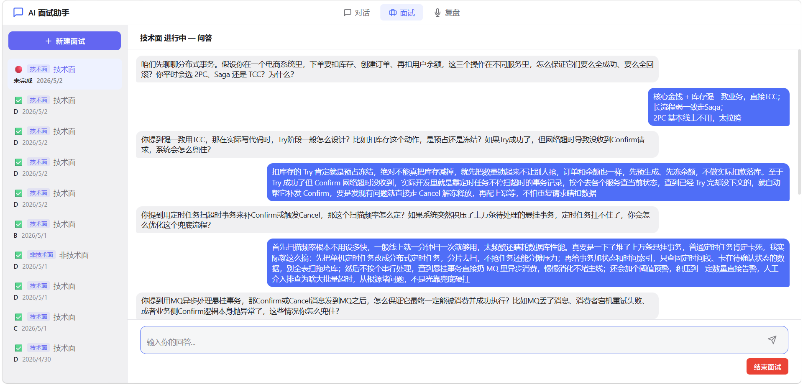
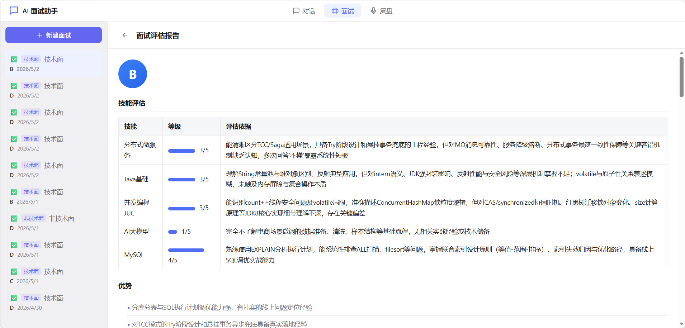
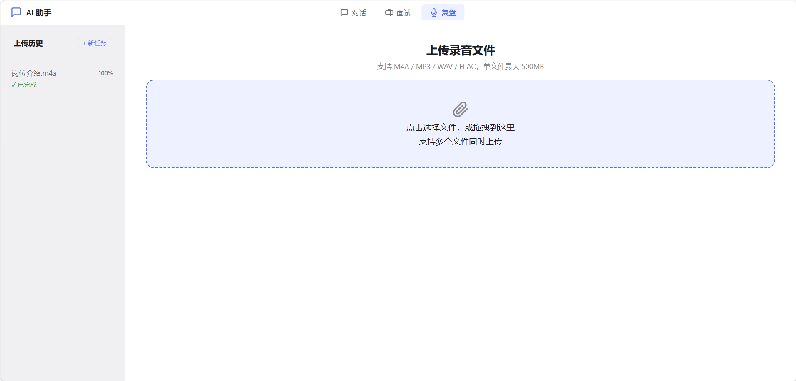
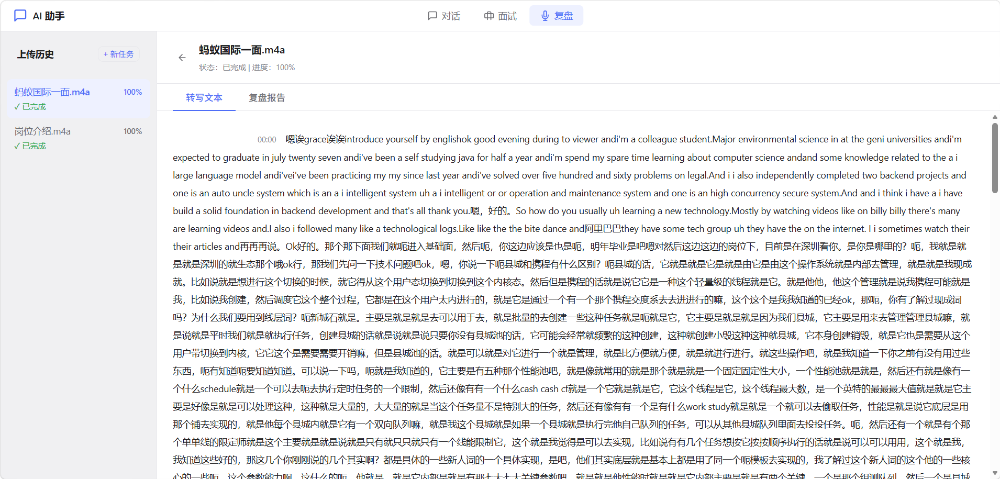

# TechMock

一个基于 Spring Boot 3 + 阿里云 Qwen 大模型的 AI 技术面试与知识问答平台。

## 项目演示










## 核心功能

### AI 模拟面试
- AI 面试官基于状态机驱动（开场 → 提问 → 收尾 → 完成）进行多轮面试
- 实时检测回答质量，识别违规行为并自动调整策略
- 面试结束后自动生成结构化评分报告

### RAG 智能问答
- 四层处理管道：意图识别 → 查询扩展 → 混合检索 → 重排生成
- Milvus 混合向量检索：Dense 向量 + Sparse 双路召回
- SSE 流式输出，实时推送 AI 回复

### 音频转写与复盘
- 支持 500MB 大文件分块上传
- RocketMQ 异步处理，SiliconFlow API 语音转文字
- 基于转写文本自动生成技术复盘报告

### 知识库管理
- 支持 .txt / .md 文件上传，自动切分、Embedding、入库
- 同名文件自动覆盖，确保知识库实时性

## 技术栈

| 分类 | 技术 |
|------|------|
| 后端框架 | Spring Boot 3.2.0, Spring Web, Spring Data JPA |
| AI 框架 | Spring AI Alibaba 1.1.0, Spring AI 1.1.2 |
| 大模型 | 阿里云 Qwen-plus |
| 向量数据库 | Milvus 2.5 |
| 消息队列 | RocketMQ 5.3 |
| 缓存 | Redis |
| 数据库 | MySQL 8.0 |
| 语音转写 | SiliconFlow TeleSpeechASR |

## 快速开始

### 环境要求

- JDK 17+
- Maven 3.8+
- MySQL 8.0
- Redis
- Milvus 2.5
- RocketMQ 5.3

### 启动步骤

1. **获取 API Key**

- **阿里云 DashScope（Qwen 大模型）**：访问 [DashScope 控制台](https://dashscope.console.aliyun.com/) 注册并创建 API Key
- **SiliconFlow（语音转写）**：访问 [SiliconFlow 官网](https://siliconflow.cn/) 注册并获取 API Key

2. **配置 API Key**

打开 `TechMock/src/main/resources/application.yml`，修改以下内容：

```yaml
# 1. DashScope API Key（AI 对话 + 向量化）
dashscope:
  api:
    key: YOUR_DASHSCOPE_API_KEY

spring:
  ai:
    dashscope:
      api-key: YOUR_DASHSCOPE_API_KEY

# 2. SiliconFlow API Key（音频转写）
siliconflow:
  api-key: YOUR_SILICONFLOW_API_KEY
```

3. **启动基础设施**

```bash
docker compose -f vector-database.yml up -d
# 确保 MySQL、Redis、RocketMQ 已运行
```

3. **启动服务**

```bash
cd TechMock
mvn spring-boot:run
```

服务将在 `http://localhost:9900` 启动。

## 项目结构

```
TechMock/
├── src/main/java/org/example/
│   ├── controller/          # REST API 控制器
│   ├── service/             # 业务逻辑层
│   ├── entity/              # JPA 实体
│   ├── repository/          # 数据访问层
│   ├── dto/                 # 数据传输对象
│   ├── config/              # 配置类
│   ├── mq/                  # RocketMQ 消息队列
│   └── client/              # 外部客户端封装
├── src/main/resources/
│   ├── static/              # 前端静态资源
│   └── application.yml      # 应用配置
├── pom.xml                  # Maven 构建配置
└── vector-database.yml      # Docker Compose 配置
```

## License

[MIT](./LICENSE)
